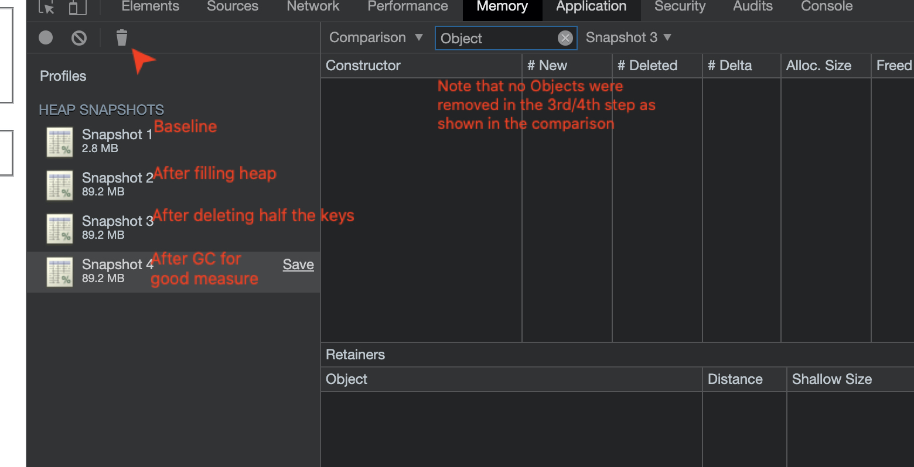
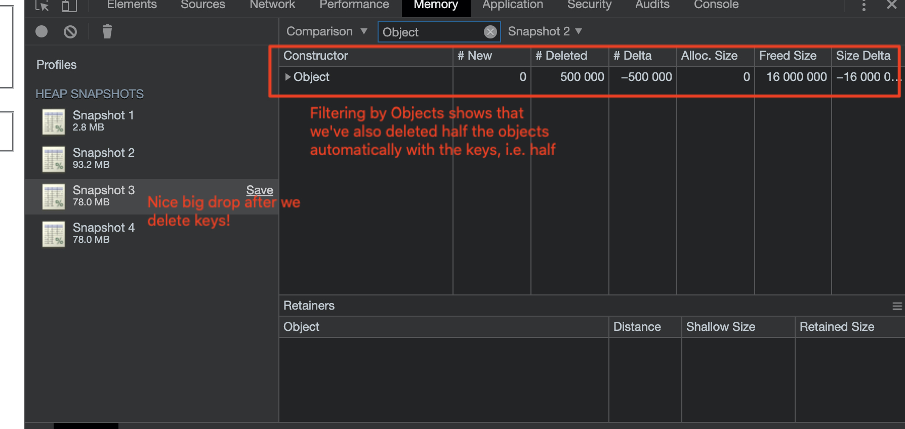

# WeakMap demo
This is a demonstration of how [WeakMaps](https://developer.mozilla.org/en-US/docs/Web/JavaScript/Reference/Global_Objects/WeakMap#Why_WeakMap) in JavaScript enable more efficient reclamation of [heap memory](https://developer.mozilla.org/en-US/docs/Web/JavaScript/Reference/Global_Objects/WeakMap#Why_WeakMap) during garbage collection. 

### Objects vs. Maps vs. WeakMaps
Maps offer a much nicer interface to creating dictionaries than Objects in JavaScripts, including the ability to store values with more than just strings/Symbols as strings.

WeakMaps are a more optimized version of Maps, which automatically delete _values_ when _references to their keys_ are deleted.

This demo is an attempt at my trying to see this in action.

### How to use the demo

To run the server, run `yarn install && yarn dev` and open http://localhost:8080 in the browser. Make sure to keep the console open to see logs from the demo.

The radio options at the top allow you to use `Objects`, `Maps` or `WeakMaps` to store a random set of data. Choose one of them, and click `Fill data` to populate variables with some random data. Use the `Lookup values by key` to see the values by key (index).

### WeakMap memory-efficiency
I've found the best way to understand WeakMaps was to see them in action. To do the same, follow the steps below, first for `Maps`, and then for `WeakMaps`. I've included Objects mostly for completeness, but they don't really illustrate much:

1. Select `Use Map` to start with storing the data in a map.
1. In Chrome's (or Firefox's/whatever's) memory tab, take a baseline `Heap snapshot`.
1. Click `Fill data` to fill in a bunch of random data. You'll see a console message showing you that `1,000,000` values have been created, with their associated keys.
1. Take another Heap snapshot. You'll note in the left panel that our heap usage has inflated considerably.
1. Choose the `Comparison` option in the right side panel at the top. In the input next to it, type in `Object` to filter and see the objects we've created. You should see that we've created approximately `1,000,000` new Objects.
1. Click `Thanosify keys` (if you haven't seen Avengers: Endgame, this just means that we're deleting half the keys 😛). Capture another snapshot, and you'll see that... there's practically no difference. To confirm this, you can also trigger a garbage collection cycle by clicking `Collect garbage` in the top of the left panel.

1. Now, select `Use WeakMap` (and preferably reload the page to get a clean slate).
1. Follow steps 2-6 to see the heap snapshot before and after half the keys are evicted.
1. You should see a big drop in heap usage! Filtering by `Objects` will also confirm that half the values (objects) have been evicted magically from our `WeakMap` once the keys (references) are no longer live.

Something I realized as I worked on this demo was that `WeakMap`s only significantly improved memory reclamation for _keys_, not _values_. This makes sense, as the GC can reclaim memory for a value as soon as it is deleted, but reclaiming values (the "payload" as it's called) after those keys are deleted is a bit more involved.

An implication of using `WeakMap`s instead of `Map`s is that we have to make sure that calling code checks that a particular Map value exists before trying to use it, as the garbage collector might already have reclaimed it, which is different to when using a `Map`. Caching expensive operations thus seems like a great use for `WeakMap`!

### Limitations of this demo
This demo doesn't perfectly reflect real-world usage, since I used a `Map` as a key that I could destroy (set to `undefined`) for both `Map`s and `WeakMap`s to simulate the key being de-referenced. In real-world usage, the key no longer has any references to it because callers have not been seen for a while (think users dropping off a server). 

In any case, I found this a very insightful exercise in understanding `WeakMap`s, and hopefully, so did you!